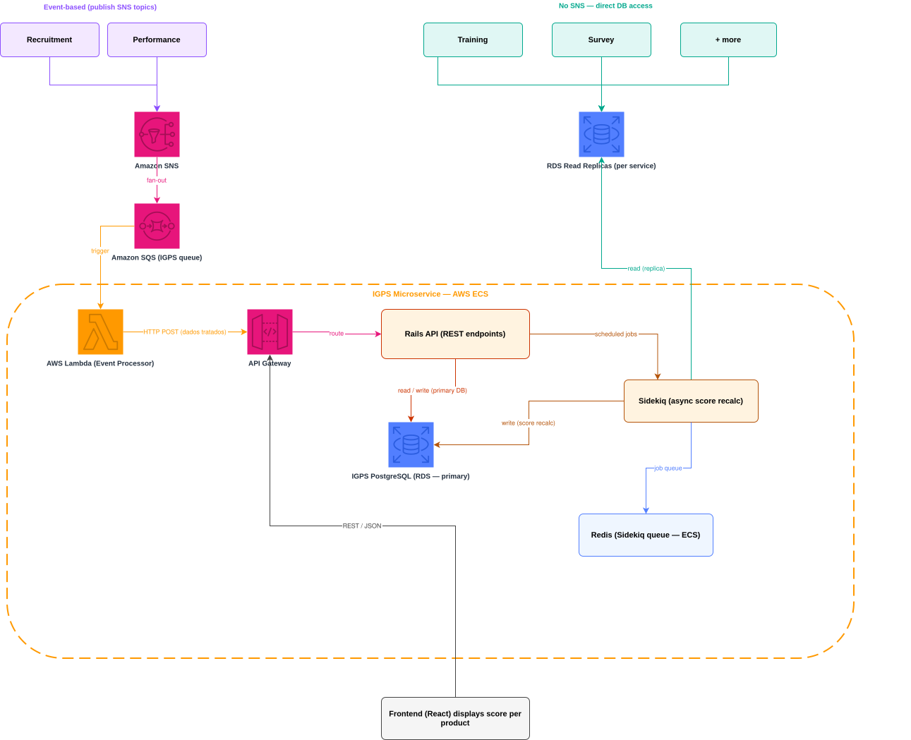

# Project Overview

This microservice evaluates how productively an HR team is using the platform. It collects indices from multiple internal services and computes a score per product area — if a team runs few surveys, for example, their people management score reflects that.

For each product area, the system outputs a score and a set of actionable recommendations, telling the HR team exactly what they should do to improve it. The goal is to give HR managers a clear picture of where they are underutilizing the platform and what actions would move the needle.

## How it works

Data is collected from other microservices through two integration paths: event-based (SNS/SQS) and direct read replica access. An AWS Lambda processes and normalizes incoming events, forwarding them to the Rails API. Background jobs handle async score recalculation via Sidekiq, ensuring scores are always up to date as new activity comes in.

- [Database](./database.md) - start here
- [Models](./models.md)
- [Services](./services.md)
- [Jobs](./jobs.md)

## Tech Stack

See [stack.md](./stack.md).

## Architecture Decisions

- **Event-based integration (SNS/SQS + Lambda):** used for services that already publish domain events and deal with incremental data. New activity as it happens, processed one event at a time.
- **Sidekiq for mature services and score calculation:** used where we needed to read data retroactively and in bulk, e.g. pulling 6 months of survey history across all companies, or reprocessing a service after a failure.
- **Read replica access:** used for services with no event system, keeping reads isolated from their primary DB.
- **Lambda as Event Processor:** stateless, scales automatically with SQS volume, no infrastructure to manage for the incremental path.

## My Role

I was the Tech Lead on this project. It was my second time in that role, leading a team of 3 developers. I worked with the architect on every major architectural decision, ran the database analysis that shaped the primary/replica split, owned the technical decisions behind the integration patterns, and built the CI/CD pipeline.

## CI/CD

GitLab CI pipeline with four stages, run on every push: Rubocop (style), Brakeman (security scan), RSpec (gated at 80% minimum coverage, currently at 97.35%), and deploy to ECS.

## Scalability & Resilience

The hardest call was deciding, per upstream service, which integration path to use:

- SNS/SQS + Lambda for services that already publish domain events and only need incremental data. It gives fan-out and retry, and absorbs traffic spikes without adding load to the source DB.
- Sidekiq for services where we need retroactive, bulk reads and heavy processing to calculate scores.
- Direct read replica for services with no event system at all. It avoids asking other teams to build event publishing just for us, at the cost of tighter coupling to their schema and some read staleness.
